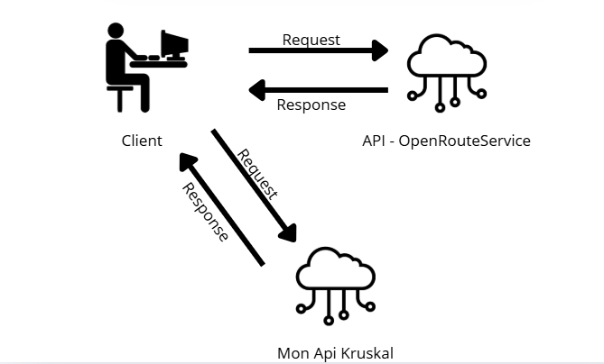
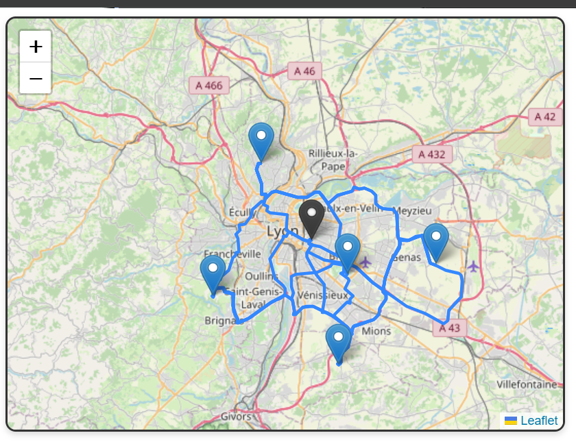
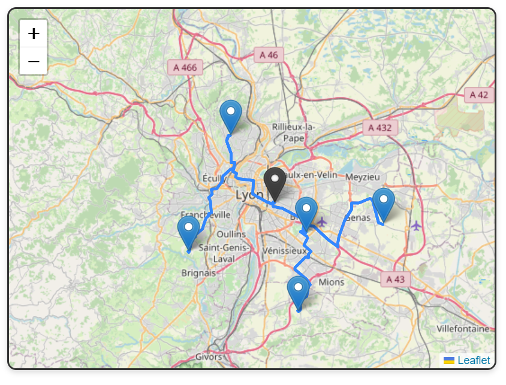

# Kruskal Route Planner - Frontend

Ce projet frontend a été développé avec **Angular** dans le cadre d’une application de planification d’itinéraires optimisés. Il s’intègre avec une **API backend (Kruskal API)** pour calculer des routes optimisées à l’aide de l’algorithme de Kruskal, et avec **l’API OpenRouteService** pour obtenir les distances entre les points géographiques.

### Image de la communication entre frontend et les APIs

## 🎯 Objectif de l'application

- Permettre à l'utilisateur de sélectionner des points sur une carte.
- Communiquer avec l'API OpenRouteService pour récupérer les distances entre les marqueurs.
- Envoyer ces données à l'API Kruskal pour obtenir un itinéraire optimisé.
- Afficher le résultat visuellement sur l’interface frontend.
  
### Image du site sans optmisation

### Image du site avec optmisation

## 🧩 Technologies utilisées

- Angular  
- TypeScript  
- Leaflet (bibliothèque de cartographie)  
- API REST  
- Intégration avec l'API OpenRouteService  
- Intégration avec l'API Kruskal (backend)

## 🔗 Communication avec les APIs

L’application envoie des données au backend via des appels REST, et interroge également l’API OpenRouteService en parallèle. Le frontend agit donc comme **pont central** entre l’utilisateur et les deux services.
